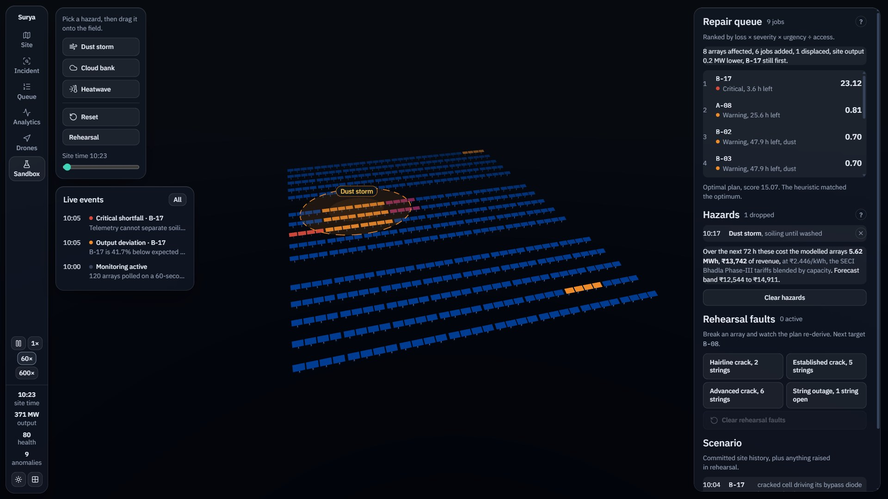
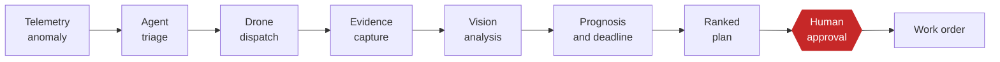
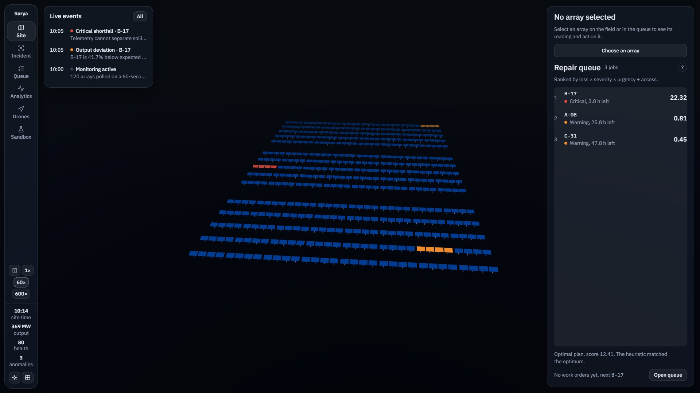
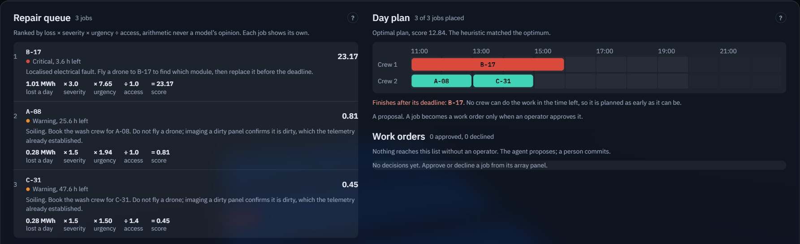
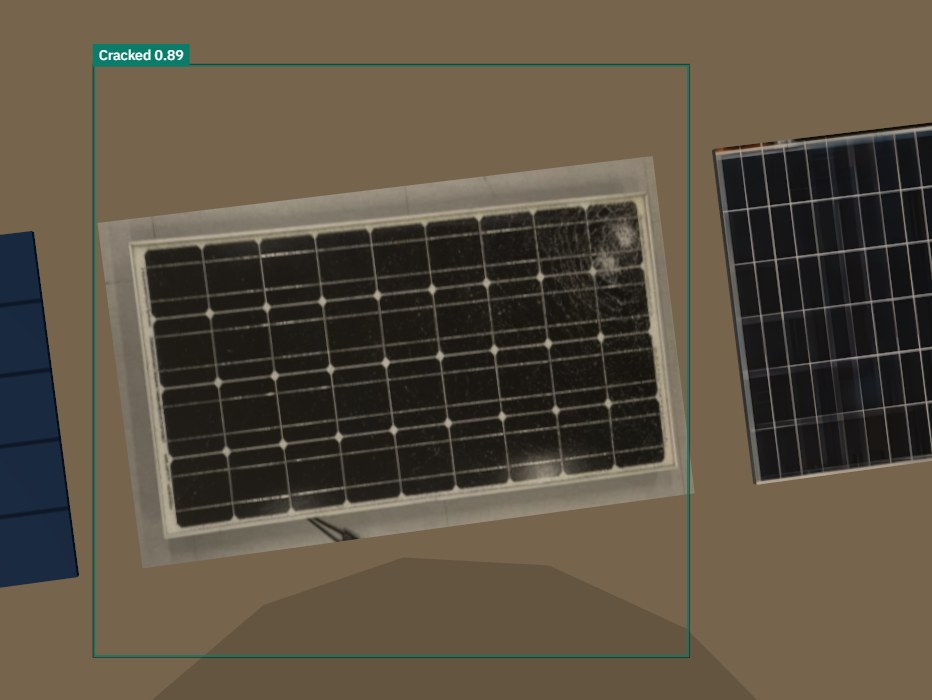
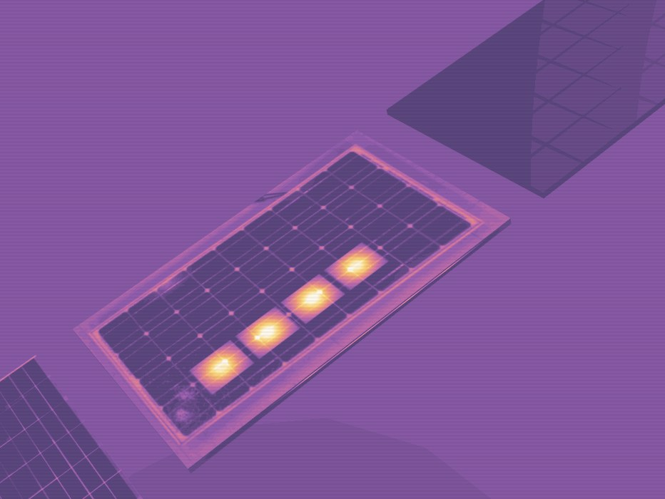
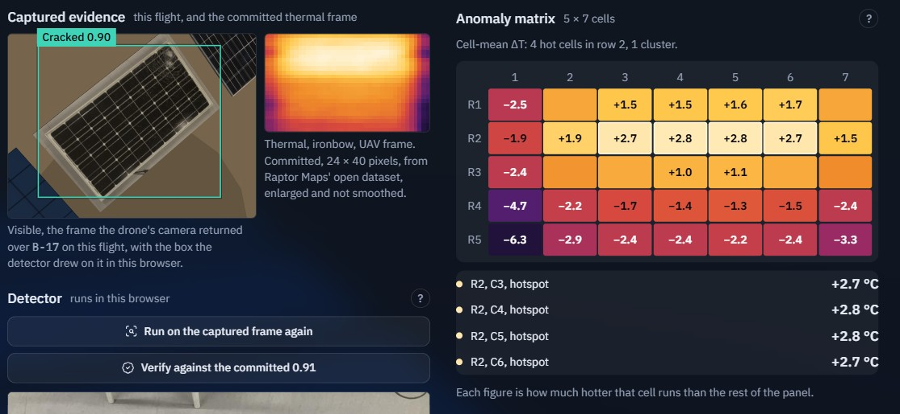
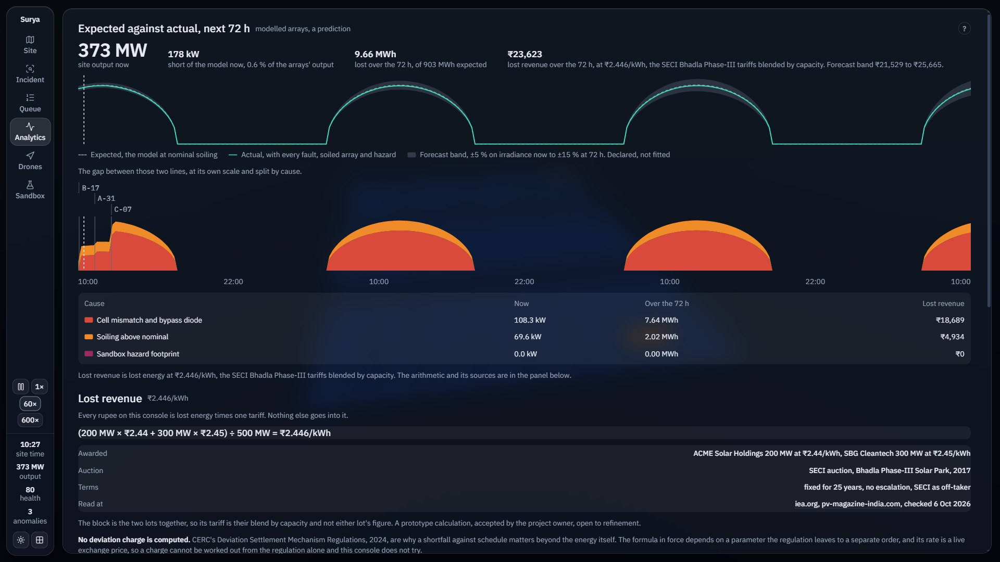
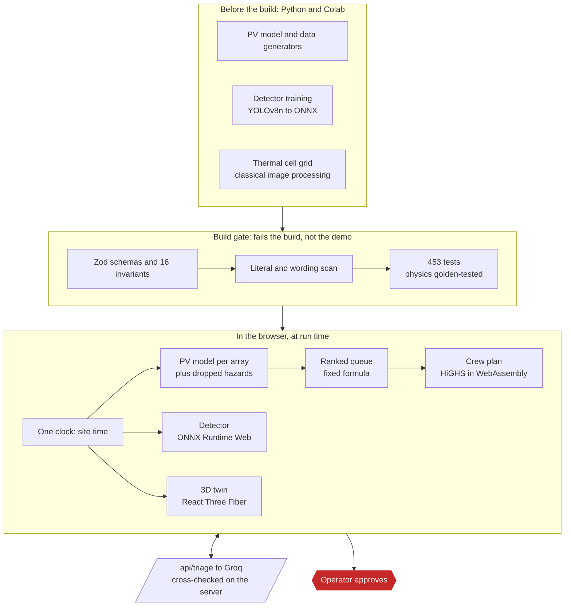

<div align="center">

# SURYA AGENT

### The plan, not the picture.

An AI agent that watches a utility-scale solar plant, sends a drone to verify what
telemetry cannot, and hands the operator a ranked repair plan with a computed
deadline. A person approves it before anything is scheduled.

[](LICENSE)


-00796B)



<sub>The what-if sandbox. A dust storm is dragged onto the field, and the queue, the deadlines, the crew plan and the cost in rupees are worked out again.</sub>

</div>

---

## Contents

- [What it is](#what-it-is)
- [Why it is different](#why-it-is-different)
- [A tour](#a-tour)
- [Quick start](#quick-start)
- [How it works](#how-it-works)
- [Measured, not targeted](#measured-not-targeted)
- [What is real, and what is not](#what-is-real-and-what-is-not)
- [The physics](#the-physics)
- [The ranking function](#the-ranking-function)
- [Data and models](#data-and-models)
- [Repository layout](#repository-layout)
- [Configuration and deployment](#configuration-and-deployment)
- [Questions this project expects](#questions-this-project-expects)
- [Status and roadmap](#status-and-roadmap)
- [Team, credits and licence](#team-credits-and-licence)

---

## What it is

A solar plant knows when its output falls. Its monitoring reports that an inverter
or a string is short, but not **which module**, whether it is **dirt or damage**, or
**how urgent** it is. So someone drives out to look, or the fault waits for the next
aerial infrared survey, which is usually flown once a year.

SURYA AGENT closes that loop on a modelled 500 MW block of Bhadla Solar Park,
Rajasthan: 120 arrays, three zones, three inverters.



Seven of those steps run unattended. The eighth is a person, on purpose.

> Periodic aerial infrared inspection "is usually performed on an annual cadence",
> so "many failures go undetected for weeks to months at a time."
> Sheppard, Cook, Perullo (Turbine Logic) and Fregosi, Bolen (EPRI),
> [*Field Experience Detecting PV Underperformance in Real Time Using Existing Instrumentation*](https://www.osti.gov/servlets/purl/1960134).

## Why it is different

Drone inspection platforms already do thermal imaging with AI defect classification,
and are building 3D twins. What they hand over is a report of defects. This project
does not claim the twin or the detection as new. It claims what comes after the
picture:

| | |
|---|---|
| **A computed deadline** | Not a flagged defect: an hour, "act before 14:00", worked out from the defect, its mechanism and the 72 h forecast. |
| **A plan that re-derives live** | Change the conditions and the queue, the deadlines and the crew day are worked out again, in 31 to 40 ms. |
| **Arithmetic on screen** | The ranking formula with its inputs on every job, and a `?` on every number for where it came from. |
| **A human gate** | The agent proposes. Only an operator's click creates a work order. |

It also says no. An array that is down evenly across every string, at normal
temperature, is dirty: the agent books a wash crew and declines to fly a drone,
because imaging a dirty panel confirms what the telemetry already said.

## A tour

<table>
<tr>
<td width="50%"><br><sub><b>Site.</b> A 3D twin of 120 arrays, with the live repair queue. A 2D map is one click away and takes over by itself if the twin cannot hold 30 fps.</sub></td>
<td width="50%"><br><sub><b>Queue.</b> Every job shows its own arithmetic. The crew day beside it is a proposal until a person approves.</sub></td>
</tr>
<tr>
<td><br><sub><b>Drone pass.</b> The detector runs in the browser on the frame the drone's camera returned. The box is the model's own.</sub></td>
<td><br><sub><b>Thermal pass.</b> The same module in the ironbow palette. A rendering of the simulated scene, not a capture.</sub></td>
</tr>
<tr>
<td><br><sub><b>Dossier.</b> The measured thermal evidence for B-17: four hot cells in one band across row 2 of the panel's 5 by 7 cells.</sub></td>
<td><br><sub><b>Analytics.</b> Expected against actual over the 72 h forecast, the loss by cause, and the tariff with its arithmetic and sources.</sub></td>
</tr>
</table>

## Quick start

Requires Node.js 20 or later and Google Chrome.

```bash
git clone https://github.com/RAK2315/solar-proj.git
cd solar-proj
npm install
npm run demo          # clean production build, served on http://localhost:3000
```

Open `http://localhost:3000` for the landing page, or `/console` for the product.
Press `S` to load the committed rehearsal state, select array `B-17`, and dispatch a
drone.

| Command | What it does |
|---|---|
| `npm run demo` | Stops whatever is on the port, wipes `.next`, builds, serves. Use this for anything shown to someone |
| `npm run build` | The gate: sync artefacts, validate data, scan for literals, run the tests, compile |
| `npm run test` | The test suite (Vitest) |
| `npm run lint` · `npm run typecheck` | ESLint, including the one-clock guardrails · TypeScript |
| `npm run check:layout` | Drives Chrome at 1920×1080 and 1366×768 and fails on clipped or undersized text. Needs the app served |
| `npm run measure:hero` | Measures drop-to-replan time and frame rate in a real Chrome window |

| Key | Action |
|---|---|
| `Space` | Run or pause site time |
| `←` `→` | Seek site time back or forward |
| `S` | Load the committed rehearsal state |
| `R` | Reset the session, from any state including mid-drag |
| `Esc` | Put a held hazard back, then close the dossier, then the array panel |

The agent triage panel needs a Groq key; see
[Configuration and deployment](#configuration-and-deployment). Without one, the
panel says the agent is unavailable and everything else works.

## How it works



**One clock.** A single Zustand store holds the site time, `session.siteSeconds`,
and a single `requestAnimationFrame` loop advances it
(`src/hooks/useSiteClock.ts`). Everything on screen is a pure function of that time
and the scenario events, through `src/store/selectors.ts`. That is why seeking
backwards works, and why a hazard dropped at 10:17 un-happens when you seek to 10:10.

**Where the AI is, and is not.**

| Part | Technique | Notes |
|---|---|---|
| Defect detection | YOLOv8n, fine-tuned by us | Runs in the browser on ONNX Runtime Web. No server, no GPU |
| Triage reasoning | A language model, `openai/gpt-oss-120b` on Groq | Writes words, never numbers. The server recomputes every fact from the physics and rejects a reply whose figures disagree |
| Prognosis | A thermal-dose model against the 72 h forecast | Produces a deadline. Computed, never looked up |
| Crew plan | Mixed-integer program, HiGHS in WebAssembly | Cut off at 50 ms, beside a greedy heuristic scored by the same function. The screen says when they match |
| Queue order | A fixed formula | Deliberately not AI. See [The ranking function](#the-ranking-function) |

**The principle the code is held to.**

> Every element on screen is traceable to a physics model, a trained model or a
> deterministic function, and the operator can see which.

It is enforced mechanically:

- `npm run validate:data` parses every data file against its Zod schema and asserts
  invariants I1 to I16. It runs before every build, so a drifted number fails the
  build.
- `npm run check:literals` fails if a headline figure is hardcoded anywhere in
  `src/`, if the tariff appears outside `src/lib/money.ts`, or if the word
  "diagnosed" is used for an array with no captured evidence.
- Two invariants are tripwires against the authors. **I11** rejects a detection
  confidence of exactly `0.84`, the original spec's placeholder. **I10** rejects a
  thermal ΔT outside the measured band, so the scaling cannot be tuned toward a
  nicer number.
- `Math.random()` is banned in `src/`. The same input gives the same site.

## Measured, not targeted

Taken on a laptop, in Chrome, and recorded with their dates in `CLAUDE.md`.

| What | Result | How it was measured |
|---|---|---|
| Automated tests | **453 passing** | Every build, before it compiles |
| 3D twin frame rate | **60.1 fps**, no frame over 20 ms | Chrome at 1366×768 and 1920×1080, idle and mid-drag |
| Hazard drop to re-planned frame | **31 to 40 ms** | A real pointer in Chrome. The budget was 150 ms |
| Crew-plan solve, the site's own days | **10.8 ms**; 1.1 ms under a heatwave | HiGHS in WebAssembly, cut off at 50 ms |
| Detector, class `Cracked` | **AP@50 0.995** | Held-out test split, 42 images |
| Detector on the drone's own frame | **Cracked 0.89 to 0.90** | Real-time flights of B-17, in the browser |
| Physics in the browser | Matches the Python model | Golden test, every build |

On the site's own scenarios the heuristic and the exact solver agree; the screen
says so and the project does not claim otherwise. A 5.8 % difference exists on one
ordinary afternoon, with three cracks queued against the end of the shift.

## What is real, and what is not

| Real | Simulated | Declared assumption | Not built |
|---|---|---|---|
| The detector, trained and measured on a held-out split | Telemetry for all 120 arrays, from the PV model with stated coefficients | Hazard strengths in the sandbox | A thermal classifier: the notebook exists, no model is trained, no metric is claimed |
| The thermal band, measured from a real UAV frame | The drone flight, in the 3D scene | Crew hours for each kind of repair | A connection to a real SCADA system or a real drone |
| The tariffs, as awarded by SECI | The 72 h weather forecast | The forecast band, ±5 % widening to ±15 % | Any deviation settlement charge |
| The PV equations, from NREL PVWatts | | The thermal span, and the dose threshold behind the deadline | A live path for prognosis and recommendation; only triage has one |

**Evidence stays with the array it was captured on.** Real imagery is held for
`B-17` only, and no other array may show it. `B-17` is *diagnosed*; the other 119
arrays are *flagged from modelled signature*.

**Rupees** are lost energy at ₹2.446/kWh and nothing else:
(200 MW × ₹2.44 + 300 MW × ₹2.45) ÷ 500 MW, the two
[SECI Bhadla Phase-III](https://www.iea.org/policies/6373-auction-of-solar-corporation-of-india-seci)
lots blended by capacity. No deviation settlement charge is computed: CERC's formula
depends on a parameter the regulation does not publish.

## The physics

Cell temperature and the power equation are **NREL PVWatts**
([NREL/TP-6A20-60272](https://docs.nrel.gov/docs/fy14osti/60272.pdf)). The
coefficients are representative crystalline-silicon values, stated here and not
implied.

```
T_cell = T_amb + ((NOCT − 20) / 800) × G
P_ac   = P_rated × (G / 1000) × (1 + γ × (T_cell − 25)) × f_soil × f_mismatch × η_inv
```

| Symbol | Value | Meaning | Provenance |
|---|---|---|---|
| `NOCT` | 45 °C | Nominal operating cell temperature | Standard c-Si datasheet value |
| `γ` | −0.0037 /°C | Power temperature coefficient | Representative c-Si (typical band −0.0035 to −0.0040). Not a specific module's datasheet figure |
| `η_inv` | 0.98 | Inverter efficiency | Typical utility-scale central inverter |
| `f_soil` | 0.97 | Soiling derate, nominal | Representative for Rajasthan before cleaning |
| `f_mismatch` | 1.0000 / **0.4160** | Cell mismatch, healthy / faulted | **Solved** to reproduce the −58.4 % string shortfall |
| `P_RATED_STRING` | **49.61 kW** | String nameplate | **Solved** so expected is 36.10 kW at reference conditions |
| `T_PROP_C` | 65 °C | Crack-propagation threshold | Engineering threshold, declared |
| `DOSE_BUDGET_H` | **5.0 h** | Time above threshold before diode-failure risk | **Solved** to reproduce the 14:00 deadline |
| `THERMAL_SPAN_C` | 25 °C | 8-bit intensity to °C scaling | **Declared assumption**: the thermal source is normalised, not radiometric |

Three of those are solved to reproduce an observable, and each says so. A declared
assumption is credible; a number tuned quietly is not.

```
T_cell   = 35.0 + (45−20)/800 × 890                        = 62.81 °C
derate   = (890/1000) × (1 − 0.0037×37.81) × 0.97 × 0.98   = 0.727669
expected = 49.61 × 0.727669                                = 36.10 kW
actual   = 36.10 × 0.4160                                  = 15.02 kW
dev_str  = 0.4160 − 1                                      = −58.4 %
dev_arr  = −58.4 × 5/7   (5 faulted strings of 7)          = −41.7 %
park     = 500 MW × 0.727669                               = 364 MW
```

`npm run validate:data` prints all of these, generated, on every run. The Python
model (`scripts/physics.py`) and the TypeScript one (`src/lib/physics.ts`) are
golden-tested against each other.

<details>
<summary><b>Numbers this project corrected, and did not reproduce</b></summary>

<br>

The original build spec's arithmetic did not close. The generator produces the
right answer and the invariants pin it.

| Was | Is | Why |
|---|---|---|
| 412 MW farm output | **364 MW** | 412 needs a 4.2 °C ambient in Rajasthan at midday |
| `P_RATED_STRING = 40.0` | **49.61** | 40.0 yields 29.11 kW, not the claimed 36.1 |
| panel −42 % and string −58.4 % | **array −41.7 %**, **string −58.4 %** | Two different objects; the array is `−58.4 × 5/7` |
| 1.44 MWh / 72 h | **3.07 MWh / 72 h** | 1.44 was `0.48 × 3`, with 0.48 itself a seed value; the integral gives 3.07 |
| baseline cell temperature 47 °C | **62.8 °C** | Contradicted the NOCT model at 890 W/m² |
| hot cells (2,5)(2,6)(4,5)(4,6) at +8/+6/+5 °C | **(2,3)(2,4)(2,5)(2,6) at about +2.8 °C** | Measured from a real thermal frame |

Full record with derivations: [`docs/contract-freeze.md`](docs/contract-freeze.md).

</details>

## The ranking function

When someone asks how it prioritises, this is the answer. It returns the same order
every time. `src/lib/ranking.ts`:

```ts
const SEVERITY_WEIGHT = { critical: 3.0, warning: 1.5, active: 1.0, info: 0.25 };

export function priorityScore(task: RepairTask): number {
  // Urgency grows hyperbolically as the deadline closes: a 4-hour deadline is
  // worth 3.5× a 24-hour one, not 6× linearly.
  const urgency = 1 + 24 / Math.max(1, task.hoursUntilDeadline);
  return (task.lossMWhPerDay * SEVERITY_WEIGHT[task.severity] * urgency) / task.accessCost;
}
```

No model touches it. On the committed queue, `INC-B17` leads the next job by about
26 times, and the reason is visible in the inputs: most energy lost, `critical`
and not `warning`, and the tightest deadline.

| Task | Loss/day | Severity | Deadline | Access | Score |
|---|---|---|---|---|---|
| `INC-B17` | 1.01 MWh | critical | 3.9 h | 1.0 | **21.53** |
| `INC-A08` | 0.28 MWh | warning | 26 h | 1.0 | 0.81 |
| `INC-C31` | 0.28 MWh | warning | 48 h | 1.4 | 0.45 |
| `INC-A22` | 0.10 MWh | active | 60 h | 1.0 | 0.14 |

In the running product these scores are recomputed as the deadline closes, so the
figure on screen is higher than the table. Same formula, later hour.

## Data and models

### Defect detector

| Field | Value |
|---|---|
| **Model** | YOLOv8n (Ultralytics), fine-tuned. 50 epochs, image size 640, on a Colab T4 |
| **Dataset** | [Solar Panel Fault Detection v2](https://universe.roboflow.com/solarvision-gwljt/solar-panel-fault-detection/dataset/2), `solarvision-gwljt`, Roboflow Universe |
| **Licence** | **CC BY 4.0**. Attribution: "Provided by a Roboflow user", via Roboflow Universe |
| **Images / boxes** | **921** (train 797 / valid 82 / test 42) · **1,067** boxes |
| **Classes, as shipped** | `BakimGereken`, `Cracked`, `Dirty`, `Good`, `Saglam` |
| **AP@50, `Cracked`** | **0.995**, held-out test split. This is the figure the project quotes |
| **mAP@50, four-class mean** | 0.9813, test split. `Dirty` is excluded: it has no test instances |
| **Evidence frame** | Cracked at **0.9084**, on a test-split image the model never saw |

Per class, on the test split: `BakimGereken` 0.940, `Cracked` 0.995, `Good` 0.995,
`Saglam` 0.995, `Dirty` undefined. `Dirty` has zero test instances, so its test AP
is undefined and is not reported as zero.

Class names are kept as the dataset ships them, including the two Turkish ones
(`BakimGereken`, "maintenance required"; `Saglam`, "intact"). Only `Cracked`
reaches the interface. The metrics are committed as data in
`data/evidence/b17_detection.json` and checked by invariant I11.

### Thermal evidence

| Field | Value |
|---|---|
| **Dataset** | [InfraredSolarModules](https://github.com/RaptorMaps/InfraredSolarModules), Raptor Maps, Inc. |
| **Licence** | **MIT** |
| **Images** | 20,000 single-module UAV thermal crops, 24×40 px, 8-bit greyscale |
| **Image used** | `7916.jpg`, labelled `Hot-Spot-Multi` |
| **Method** | `scripts/thermal_hotspot.py`: classical image processing. No model, no training |

Measured cell-mean ΔT in °C:

```
        C1     C2     C3     C4     C5     C6     C7
  R1   -2.5    0.7    1.5    1.5    1.6    1.7    0.7
  R2   -1.9    1.9   [2.7]  [2.8]  [2.8]  [2.7]   1.5    <- 4 hot cells, one cluster
  R3   -2.4    0.2    0.8    1.0    1.1    0.8    0.0
  R4   -4.7   -2.2   -1.7   -1.4   -1.3   -1.5   -2.4
  R5   -6.3   -2.9   -2.4   -2.4   -2.2   -2.4   -3.3
```

A contiguous band across row 2. Module substrings are wired in rows, so a bypassed
substring in reverse bias heats as a band and not as isolated cells: the
measurement matches the mechanism.

ΔT reads +2.8 and not the +8 a thermographer would quote, for two stated reasons.
It is a **cell mean**, not a peak pixel. And the source is **normalised 8-bit, not
radiometric**, so `THERMAL_SPAN_C = 25.0` is a declared linear scaling. The
localisation is measured; the magnitude in degrees is a documented assumption.

Full provenance: [`docs/dataset-provenance.md`](docs/dataset-provenance.md).

## Repository layout

```
src/
  app/            the landing page, /console, and the one API route, /api/triage
  lib/            pure and I/O-free: physics, live site, hazards, queue and ranking,
                  the scheduler and its LP model, money, the Zod schemas
  store/          session.ts (site time, the one clock) and selectors.ts (the public API)
  components/     shell/ · overlay/ · twin/ · scene/ · fallback/ · landing/
scripts/          Python and TypeScript. Generators, the build gate, the harnesses
  physics.py           the PV model and every constant
  generate_*.py        the site, its telemetry and its scenario
  thermal_hotspot.py   the thermal cell grid
  validate_data.ts     the build gate: Zod and invariants I1 to I16
  check_literals.mjs   no hardcoded figures, one home for the tariff, the wording rule
  check_layout.mjs     drives Chrome at two widths
data/             generated and committed: the contract between the pipeline and the app
models/           trained weights, kept as provenance
public/           the ONNX model, the HiGHS WebAssembly build, textures, evidence
ppt/              the Round 1 deck, the one-page description, their sources and build scripts
plan/             the build plans; plan/rework/ is the current one
docs/             contract freeze, dataset provenance, backlog, training record
```

To regenerate the data, each step reading the one before it:

```bash
python scripts/generate_farm.py
python scripts/generate_telemetry.py
python scripts/generate_events.py
npm run validate:data
```

If you change `generate_telemetry.py`, re-run `run_agent.py`: the cached agent prose
quotes numbers from the telemetry, and the cross-check only protects you if it runs.

## Configuration and deployment

| Variable | Purpose |
|---|---|
| `GROQ_API_KEY` | Agent triage. Server-side only; never prefix it `NEXT_PUBLIC_` |
| `GROQ_MODEL` | Optional. Defaults to `openai/gpt-oss-120b` |

Put them in `.env.local` for local runs. The project deploys to Vercel as it
stands: the build gate runs first, so a deployment cannot ship data that
contradicts the physics, and everything the app needs is committed.

There is exactly one network call, `POST /api/triage`, made when an array with
something to judge is selected. It is server-to-server: the browser never sees the
key, and the server recomputes the telemetry itself and does not trust what the
client sends. A rate limit from the provider is waited out on the server inside a
10 s budget. Telemetry, fonts, the detector and the solver are all served from the
app. There is no database.

## Questions this project expects

Each answer is a file you can open.

<details>
<summary><b>Is any of this real?</b></summary>

<br>

Telemetry is simulated on NREL's PVWatts model with the coefficients stated above;
open `scripts/physics.py`. The defect detector is fine-tuned on real labelled
imagery with recorded provenance. The hot cells are measured from a real UAV
thermal frame. The fault is a physically coherent chain: a cracked cell, a rise in
series resistance, bypass diode conduction, reverse-bias heating, and so a hot
band, because substrings are wired in rows.

</details>

<details>
<summary><b>What did you actually train?</b></summary>

<br>

`models/defect_yolov8n.pt`, with the run recorded in `docs/training/` and the
provenance table above. AP@50 is reported per class and with its split, not as a
single mean.

</details>

<details>
<summary><b>Why an agent and not a threshold dashboard?</b></summary>

<br>

The prognosis stage. A rule engine tells you a string is down. This tells you when
it becomes unrecoverable, by combining the confirmed defect, the degradation
mechanism and the 72 h forecast into a deadline no threshold can produce.

</details>

<details>
<summary><b>How does it prioritise?</b></summary>

<br>

[The ranking function](#the-ranking-function). Pure, deterministic, and identical
on every run.

</details>

<details>
<summary><b>Would you let this run unsupervised?</b></summary>

<br>

No, and that is the approval gate. Everything up to the recommendation is
autonomous; then it stops. The work order does not exist until a person clicks, and
the operator can decline with a recorded reason.

</details>

<details>
<summary><b>Why is output only 73 % of nameplate?</b></summary>

<br>

Because the cells are at 62.8 °C and crystalline silicon loses about 0.37 % of its
output per degree above 25. That is the model. The original spec claimed 412 MW,
which would need a 4.2 °C ambient in Rajasthan at midday; the model's answer was
kept.

</details>

<details>
<summary><b>Does the exact solver beat the heuristic?</b></summary>

<br>

On most of this site's days, no: they find the same plan, and the screen says so.
The solver is there because a new rule is one line of a model and the answer is
provable. A solve stopped at its 50 ms limit is reported as the best plan found,
with its gap, and is never called optimal.

</details>

<details>
<summary><b>What would you not claim?</b></summary>

<br>

That the telemetry comes from a real plant. That ΔT is a radiometric reading. That
the 3D thermal pass is a capture. That the thermal classifier exists. That the
language model produced any number on screen: it writes prose about numbers, and
the server refuses a reply containing a figure the physics does not support.

</details>

## Status and roadmap

Built, and being prepared for **JSS AI FORGE 36** (AI for Industry 4.0). The dated
record of every measurement and decision is the status box at the top of
[`CLAUDE.md`](CLAUDE.md); the full list of what is open is
[`docs/backlog.md`](docs/backlog.md).

- [x] One-view console over a 3D twin, six screens, light and dark, 2D fallback
- [x] What-if sandbox: dust storm, cloud bank, heatwave
- [x] Crew plan: exact solver beside a heuristic, 50 ms limit
- [x] Forecast to rupees at a sourced tariff
- [x] Detector trained, exported to ONNX, running in the browser
- [ ] Thermal classifier on InfraredSolarModules: train, report the held-out metric, integrate
- [ ] A live path for prognosis and recommendation
- [ ] A completion step for a repair
- [ ] A SCADA adapter in place of the simulator

The Round 1 deck, the one-page description and their sources are in [`ppt/`](ppt/).

## Team, credits and licence

**Team SIGMOID:** Rehaan Ahmad Khan, Shantanu Singh, Lakshita Rawat, Krishna Agarwal.

**Credits.**
The loop follows the RAISE-winning Robinsun solar agent; where that had a physical
drone, this has a trained defect model and a physics-grounded simulation.
Thermal data is Raptor Maps' open [InfraredSolarModules](https://github.com/RaptorMaps/InfraredSolarModules) (MIT).
Training data is [Solar Panel Fault Detection v2](https://universe.roboflow.com/solarvision-gwljt/solar-panel-fault-detection/dataset/2) on Roboflow Universe (CC BY 4.0).
The PV model is [NREL PVWatts](https://docs.nrel.gov/docs/fy14osti/60272.pdf).
The solver is [HiGHS](https://highs.dev). No personal or proprietary data is used.

**Licence.** [AGPL-3.0](LICENSE). Ultralytics YOLOv8 is AGPL-3.0 and that licence
extends to custom-trained weights; `models/defect_yolov8n.pt` is committed as
provenance, so this repository is AGPL-3.0. That is a decision, not an accident.
Switching to a permissively licensed detector such as RF-DETR (Apache-2.0) would
touch one script and no components.
