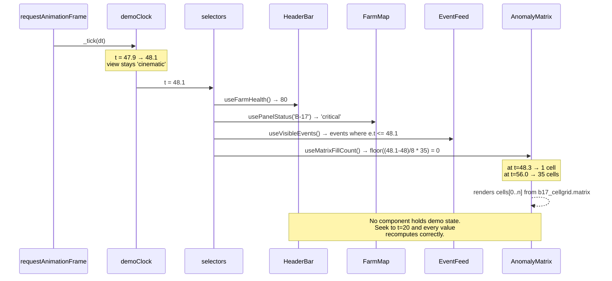

# 02 — Architecture

---

## 1. Component overview

There is **no server**. This is a static Next.js app reading committed JSON, plus an offline Python pipeline that produces that JSON. That is the single most important architectural fact: it removes the entire class of demo-day failures involving networks, rate limits, cold starts, and GPUs.

| Component | Single responsibility | Runtime? |
|---|---|---|
| `scripts/*.py` | Produce every number and artefact in `/data`. | **No** — offline, run once, output committed |
| `data/*.json` | The frozen contract between the pipeline and the app. | Build-time import |
| `models/defect_yolov8n.pt` | Trained weights, committed as provenance evidence. | No — inference is offline |
| `src/store/demoClock.ts` | **The** clock. The only source of time. | Yes |
| `src/store/selectors.ts` | Pure functions `t → view state`. The only way components learn anything. | Yes |
| `src/lib/physics.ts` | TS mirror of the Python model, for derived display only. | Yes |
| `src/lib/ranking.ts` | Deterministic repair-queue ordering. Pure, no I/O. | Yes |
| `src/components/console/*` | The operator console. | Yes |
| `src/components/cinematic/*` | Full-bleed overlays. | Yes |
| `src/components/scene/*` | R3F 3D scene. | Yes (Phase 7) |

## 2. Architecture diagram

### ASCII

```
  OFFLINE (Python, run once, output committed)          RUNTIME (browser, static)
  ═══════════════════════════════════════════           ═══════════════════════════

  generate_farm.py ──────► farm.json ────────┐
  generate_telemetry.py ─► telemetry.json ───┤
      │ PVWatts/NOCT model                   │
      └─► forecast.json ────────────────────-┤
  generate_events.py ────► events.json ──────┤
                                             │      ┌──────────────────────────┐
  train_defect_model.py ─► defect_yolov8n.pt │      │   demoClock (zustand)    │
      │ Colab T4, YOLOv8n                    ├─────►│   t : number  ← rAF      │
      └─► detect_on_evidence.py              │      │   approved : boolean     │
             └─► b17_rgb_annotated.jpg       │      └────────────┬─────────────┘
             └─► b17_detection.json ─────────┤                   │
                                             │                   ▼
  thermal_hotspot.py ────► b17_cellgrid.json ┤      ┌──────────────────────────┐
      │ OpenCV, classical                    │      │  selectors.ts (PURE)     │
      └─► b17_thermal.png ───────────────────┤      │  t ──► everything        │
                                             │      └────┬────────┬────────┬───┘
  run_agent.py ──► Groq ──► agent_cache.json ┘           │        │        │
      │ 3 stages                                          ▼        ▼        ▼
      └─► cross-check vs telemetry.json               console  cinematic  scene
             (fails loudly on mismatch)                   │        │        │
                                                          └────────┴────────┘
                                                            ONE FRAME, ONE t
```

### Mermaid

```mermaid
graph TD
    subgraph Offline["OFFLINE — Python, run once"]
        GF[generate_farm.py] --> FARM[(farm.json)]
        GT[generate_telemetry.py<br/>PVWatts/NOCT] --> TEL[(telemetry.json)]
        GT --> FC[(forecast.json)]
        GE[generate_events.py] --> EV[(events.json)]
        TR[train_defect_model.py<br/>Colab T4] --> W[(defect_yolov8n.pt)]
        W --> DET[detect_on_evidence.py]
        DET --> DJ[(b17_detection.json)]
        TH[thermal_hotspot.py<br/>OpenCV] --> CG[(b17_cellgrid.json)]
        RA[run_agent.py] --> GROQ{{Groq API}}
        GROQ --> AC[(agent_cache.json)]
        TEL -.numeric cross-check.-> RA
    end

    subgraph Gate["BUILD GATE"]
        VAL[validate:data<br/>Zod + invariants]
    end

    FARM --> VAL
    TEL --> VAL
    FC --> VAL
    EV --> VAL
    AC --> VAL
    CG --> VAL
    DJ --> VAL

    subgraph Runtime["RUNTIME — static, no server"]
        CLK[demoClock<br/>t, approved]
        SEL[selectors.ts<br/>PURE t to state]
        CLK --> SEL
        SEL --> CON[console/*]
        SEL --> CIN[cinematic/*]
        SEL --> SCN[scene/*]
        CON -.rendered at 0.31 scale.-> CIN
    end

    VAL --> SEL
```

Note the dotted edge `console → cinematic`: the PiP is the **real console component tree**, not a capture. That single edge is what makes the two halves provably one system.

## 3. Data flow — one beat, traced



## 4. Interface contracts

There is no HTTP API. The contracts are **the JSON file shapes** (`03-data-model.md`) and **the selector signatures** below. Treat the selector list as the app's public API — components may call these and nothing else.

```ts
// src/store/selectors.ts — the complete public surface.
// Every one is a pure function of `t` (plus `approved` where noted).

useFarmHealth():          number                    // 94 → 80 across t=6..9
useFarmOutputMW():        number                    // 364 at demo conditions
useAnomalyCounts():       { total: number; critical: number }
useWeather():             { ambientC, irradiance, windMs, cloudPct }

useVisibleEvents():       DemoEvent[]               // e.t <= t, newest first
useAgentStage():          'triage' | 'prognosis' | 'recommendation' | null

usePanelReading(id):      PanelReading              // actual/expected/deviation/status
usePanelStatus(id):       'healthy'|'warning'|'critical'|'scheduled'
useInverterReadings():    Record<string, InverterReading>

useDroneState():          { status: 'STANDBY'|'ACTIVE'; batteryPct: number; padId: string }
useDronePosition():       { x: number; y: number }  // SVG coords, sampled along route
useRouteProgress():       number                    // 0..1, drives stroke-dashoffset

useMatrixFillCount():     number                    // 0..35, scan-order reveal t=48..56
useCellGrid():            CellGrid
useDetection():           Detection                 // real model output

useStreamedText(s, t0):   string                    // typewriter, 45 cps, pure
useForecast():            Forecast
useRepairQueue():         RepairTask[]              // ranked; length 4, or 3 if approved
useApproved():            boolean
```

**Rule:** a component that needs data imports a hook from `selectors.ts`. It never imports from `data/` directly, and it never computes a demo value inline. This is the seam that makes the seek-backwards guarantee hold — see §6.

### The one non-derived contract

```ts
// The ONLY mutable state outside the clock in the entire application.
approve(): void   // sets approved = true
```

Everything else is `f(t)`. If you find yourself adding a second piece of mutable state, you have found a bug in your design, not a missing feature.

### Model I/O contract (offline)

```
detect_on_evidence.py
  in:  models/defect_yolov8n.pt, data/evidence/b17_rgb.jpg
  out: data/evidence/b17_detection.json
       { "label": "crack",
         "confidence": <float, WHATEVER THE MODEL RETURNS>,
         "bbox": [x, y, w, h],          // normalised xywh
         "model": "yolov8n-solar-defect",
         "mAP50": <float, from the training run> }
```

`confidence` is never written by hand and never rounded. If it comes back 0.71, the reticle says 0.71 and `CLAUDE.md` §2's caption changes to match.

## 5. Tech-stack decisions (ADR-style)

#### Decision: No backend, no database — static export reading committed JSON
- **Context:** Something must serve telemetry, events, and agent output to the console.
- **Options:** (a) FastAPI + Postgres; (b) Next.js API routes + SQLite; (c) committed JSON imported at build time.
- **Chosen:** **(c)**, because there is no persistence requirement in the demo script — a work order "creation" writes to Zustand and nothing else — and because every server is a demo-day failure mode (cold start, rate limit, network). It also makes the "is this data real?" answer *stronger*, not weaker: the data is generated by a documented model and committed, so a judge can diff it.
- **Consequences:** Regenerating data requires re-running Python and committing. No multi-user, no history. Both are explicitly out of scope. `validate:data` becomes essential since there's no runtime schema enforcement.

#### Decision: Zustand for the clock, not Context or Redux
- **Context:** ~30 components need `t` at 60fps without re-rendering the world.
- **Options:** React Context (re-renders every consumer on every tick — fatal at 60fps); Redux Toolkit (ceremony for one number); Zustand with selector subscriptions.
- **Chosen:** **Zustand**, because `useDemoClock(s => s.t)` subscribes granularly, and `useDemoClock.getState().t` lets `useFrame` read the clock inside the R3F render loop **without subscribing at all** — which is exactly what `CameraRig` needs.
- **Consequences:** The store must stay tiny. Resist the urge to put derived state in it; derived state lives in `selectors.ts` as `useMemo` over `t`.

#### Decision: `openai/gpt-oss-120b` on Groq, replacing `llama-3.3-70b-versatile`
- **Context:** Three cached reasoning calls. The model ID is **rendered on screen** in each agent card, so a dead ID is visible to the audience.
- **Options:** `llama-3.3-70b-versatile` (deprecated 2026-06-17, free tier included); `openai/gpt-oss-120b` (Groq's own stated migration target); `openai/gpt-oss-20b` (smaller, faster, weaker reasoning); a paid provider.
- **Chosen:** **`openai/gpt-oss-120b`**, because it is Groq's recommended replacement, it's on the free tier, and 120B-class reasoning is comfortably enough for three constrained JSON-schema calls. Output is cached anyway, so latency is irrelevant.
- **Consequences:** `AgentCache.meta.model` and the card headers change. Since output is cached, a future deprecation cannot break the demo — only a re-run. Record `generatedAt` so the cache's age is auditable.

#### Decision: YOLOv8n (AGPL-3.0) over RF-DETR (Apache-2.0)
- **Context:** Committing custom-trained Ultralytics weights makes the entire repository AGPL-3.0. RF-DETR is Apache-2.0 with no copyleft and generally higher accuracy on small objects.
- **Options:** (a) YOLOv8n + accept AGPL; (b) RF-DETR + Apache-2.0; (c) YOLOv8n + keep repo private.
- **Chosen:** **(a)**, because this is a personal project with no commercial or closed-source requirement, YOLOv8n's Colab-T4 fine-tune path is the best-documented 30-minute route to a trained model, and `CLAUDE.md` §11 already specifies it. **Add an explicit `LICENSE` file (AGPL-3.0) and state it in the README** — the licence must be a decision, not an accident.
- **Consequences:** The repo must be AGPL-3.0 and stay open. If this ever becomes commercial, retrain on RF-DETR — the `detect_on_evidence.py` output contract is model-agnostic by design, so that swap touches one script and zero components.
- **Revisit if:** you ever want this closed-source or in a portfolio piece with a restrictive licence.

#### Decision: SVG for the farm map, not Canvas
- **Context:** 120 panel rects with hatch fills, a dashed selection rect, and an animated route path.
- **Options:** Canvas 2D; SVG; WebGL.
- **Chosen:** **SVG**, because `<pattern>` diagonal hatch is one declaration and gives the "engineering drawing" read that a heatmap can't; because `stroke-dashoffset` from `t` is trivially seekable; and because 120 rects is nowhere near an SVG perf concern.
- **Consequences:** Don't scale this to 10,000 panels. We render 120 by design.

#### Decision: R3F v9 pinned, not v8
- **Context:** Next.js 15 ships React 19. **@react-three/fiber v8 does not work on React 19.**
- **Chosen:** `@react-three/fiber@^9`, `@react-three/drei@^10`, `three@^0.180`. Pin exact versions.
- **Consequences:** Some drei components (`MeshPortalMaterial`, `RenderTexture`) have known React-19 quirks. We use neither. The R3F `Canvas` must be `dynamic(..., { ssr: false })` under App Router.

#### Decision: Video-backed cinematic ships before the 3D scene
- **Context:** With no deadline, the 3D scene is achievable — but it's still the highest-variance component.
- **Chosen:** Build the overlays over a CC0 Pexels flyover first (Phase 6), then swap the background layer for R3F (Phase 7). The overlays are identical either way.
- **Consequences:** You are never without a complete demo. The swap is one component boundary (`<CinematicBackground />`), so it is genuinely a swap and not a rewrite.

### Locked stack

```
Next.js 15 (App Router, TypeScript strict) · Tailwind CSS v4
shadcn/ui (Card, Badge, Button, ScrollArea, Tabs, Separator, Progress)
zustand · framer-motion (entrances only) · recharts · lucide-react
@react-three/fiber@^9 · @react-three/drei@^10 · three@^0.180
zod (data validation gate)

Python 3.10 — scripts/ only, never runtime
numpy · pandas · ultralytics · opencv-python · matplotlib · groq · scipy (H1 only)

Deploy: Vercel static. No runtime GPU. No database. No auth.
```

## 6. File layout & the conventions that keep it navigable

Follow `CLAUDE.md` §5's tree. The **seams** matter more than the tree:

1. **All demo data enters through `src/store/selectors.ts`.** Components never `import data from '@/data/...'`. Consequence: every file name and JSON key exists in exactly one file, so a schema change is a one-file edit.

2. **`src/lib/*.ts` is pure and I/O-free.** `physics.ts`, `ranking.ts`, `format.ts` take arguments and return values — no React, no imports from `store/`. Consequence: they are unit-testable, and `ranking.ts` can be *shown to a judge* as a self-contained function.

3. **The single-clock invariant.** Exactly one `requestAnimationFrame` loop exists, in `src/hooks/useDemoClock.ts`, mounted once in `layout.tsx`.
   - **Banned in `src/components/`:** `setInterval`, `setTimeout`, `requestAnimationFrame`, and any CSS animation that drives *state*.
   - **Allowed:** presentational CSS animation (pulse, glow, rotor spin) that no selector reads.
   - **`useFrame` is allowed only in `src/components/scene/`**, and only to *read* `useDemoClock.getState().t`, never to accumulate.
   - Enforce with a lint rule (§7) — this is the failure mode `CLAUDE.md` §17 ranks most likely.

4. **No `useState` may hold demo content.** If a component stores something that should have been derived from `t`, seeking backwards breaks. The only `useState` allowed is genuinely local UI (a `show more` toggle).

5. **Numbers are formatted in `format.ts`, never inline.** One place decides that power renders `15.02 kW` and deviation renders `−58.4%` with a real minus sign (U+2212, not a hyphen) and tabular numerals.

6. **`src/lib/types.ts` is the single schema owner.** Zod schemas live beside the types and are the source of truth for `validate:data`; TS types are inferred via `z.infer`. One definition, not two that drift.

## 7. Guardrails (cheap, high-leverage)

```jsonc
// .eslintrc — the invariants that actually protect the demo
"no-restricted-globals": ["error",
  { "name": "setInterval",  "message": "One clock only. Derive from t." },
  { "name": "setTimeout",   "message": "One clock only. Derive from t." }
],
"no-restricted-syntax": ["error", {
  "selector": "CallExpression[callee.name='requestAnimationFrame']",
  "message": "The only rAF loop lives in hooks/useDemoClock.ts."
}]
```
Plus `npm run check:literals` — greps `src/components/` for `58.4|36.10|15.02|364|1.44|0.84` and fails if found. Every one of those must come from `/data`.

## 8. External dependencies & data sources

| Dependency | Auth | Limits / licence | Fallback (demo-safe) |
|---|---|---|---|
| **Groq API** (`openai/gpt-oss-120b`) | `GROQ_API_KEY` | Free tier, RPM/RPD limited | **Output is cached and committed.** The demo never calls Groq. Only `run_agent.py` does, offline. |
| **Roboflow Universe** solar-defect dataset | free account | Most are CC BY 4.0 — **record exact name + licence in README** | Several equivalents exist (`crack-solar-panel`, `solar-panel-fault-dataset`). Pick one that loads; don't over-search. |
| **PVMD thermal dataset** (Mendeley `10.17632/5ssmfpgrpc.1`) | none | public; DJI Mavic 3T, hotspots/cracks/shadings | Alfaro-Mejía IR set (277 images) or any thermal PV image — `thermal_hotspot.py` is classical CV and works on any calibrated grayscale. |
| **Pexels / Pixabay** flyover video | none | free for commercial use, no attribution required (still credit it) | Download and commit the clip. **Never hotlink.** |
| **Ultralytics YOLOv8n** | none | **AGPL-3.0 — contagious to weights** | Repo is AGPL-3.0 with a `LICENSE` file. |
| **Colab free T4** | Google account | session timeouts | Checkpoint every 10 epochs to Drive; weights are committed once and never retrained during a demo. |

**Demo-safe rule, applied:** every external dependency is consumed **offline and committed**. On demo day the app makes zero network calls. There is no "live integration" to fake, and no badge needed — the honest framing is "telemetry is simulated on a published PV performance model; the detector is trained on real labelled imagery," which is stronger than a live pull would be.

## 9. Environment variables

```bash
# .env.local — required only for the OFFLINE scripts. The app needs none.

GROQ_API_KEY=gsk_...            # scripts/run_agent.py only. Never referenced in src/.
GROQ_MODEL=openai/gpt-oss-120b  # written into AgentCache.meta.model, rendered on screen
LIVE_AGENT=false                # true bypasses the cache at runtime (dev only, default off)
ROBOFLOW_API_KEY=...            # scripts/train_defect_model.py, dataset download only
```

If `GROQ_API_KEY` is absent the app still builds and runs — it reads the committed cache. **That is the design.** A missing key must never be able to break the demo.

---

## Sources

- [Groq Model Deprecations](https://console.groq.com/docs/deprecations)
- [React Three Fiber — version pairing](https://r3f.docs.pmnd.rs/getting-started/installation)
- [Ultralytics License (AGPL-3.0)](https://www.ultralytics.com/license)
- [RF-DETR — Apache 2.0](https://github.com/roboflow/rf-detr)
- [Pexels — Drone Footage of a Solar Farm](https://www.pexels.com/video/drone-footage-of-a-solar-farm-7042814/)
