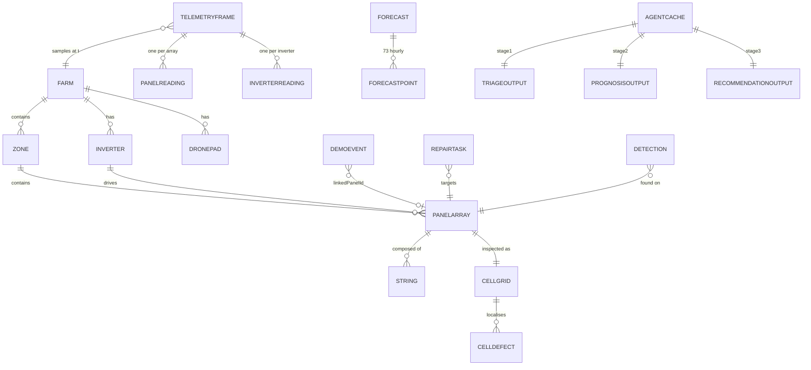

# 03 — Data model

There is no database. **The committed JSON files in `/data` are the data model**, and the runnable companion to this document is **`plan/schemas.ts`** (Zod) rather than a `schema.sql`. The two must stay in exact sync: `src/lib/types.ts` imports the Zod schemas and infers its TypeScript types via `z.infer`, so there is one definition, never two that drift.

The Python generators write JSON; `npm run validate:data` parses it. A generator that emits a field the schema doesn't know about, or a number that violates an invariant, **fails the build** — not the demo.

---

## 1. Entity relationships



`STRING` is new relative to `CLAUDE.md` §7 — it is what resolves correction **C3**. See §4.

## 2. File-by-file spec

| File | Purpose | Written by | Key contents |
|---|---|---|---|
| `data/farm.json` | Static site geometry | `generate_farm.py` | 1 `Farm`, 3 `Zone`, 120 `PanelArray`, 3 `Inverter`, 2 `DronePad` |
| `data/telemetry.json` | Time series, fault injected | `generate_telemetry.py` | **91** `TelemetryFrame` (t = 0..90 inclusive) |
| `data/events.json` | Scripted feed | `generate_events.py` | ~12 `DemoEvent`, ordered by `t` |
| `data/forecast.json` | 72h weather | `generate_telemetry.py` | **73** `ForecastPoint` (hourOffset 0..72) + summary fields |
| `data/agent_cache.json` | Pre-run LLM output | `run_agent.py` | 1 `AgentCache` (3 stages + meta) |
| `data/evidence/b17_cellgrid.json` | Per-cell ΔT | `thermal_hotspot.py` | 1 `CellGrid`, 5×7 matrix, 4 defects |
| `data/evidence/b17_detection.json` | Real model output | `detect_on_evidence.py` | 1 `Detection` + `mAP50` |
| `data/repair_queue.json` | Queue inputs (unranked) | `generate_telemetry.py` | 4 `RepairTask`; ranking happens in TS |

Binary evidence (not schema-validated, but existence-checked): `b17_rgb.jpg`, `b17_rgb_annotated.jpg`, `b17_thermal.png`, `b17_inverter_audio.wav`, `b17_flyover.mp4`.

## 3. Enums — enumerated in full

Agents get implied sets wrong. These are the complete sets; nothing else is legal.

```ts
Severity        = 'info' | 'active' | 'warning' | 'critical'
PanelStatus     = 'healthy' | 'warning' | 'critical' | 'scheduled'
ZoneId          = 'A' | 'B' | 'C'
DefectType      = 'dead' | 'crack' | 'hotspot' | 'soiling'
RiskLevel       = 'low' | 'medium' | 'high'
TriageSeverity  = 'low' | 'medium' | 'high' | 'critical'
DroneStatus     = 'STANDBY' | 'ACTIVE' | 'RETURNING'
DemoView        = 'console' | 'cinematic'
AgentStage      = 'triage' | 'prognosis' | 'recommendation'
EventSource     = 'SYSTEM' | 'PANEL B-17' | 'DRONE 01' | 'DRONE 02'
                | 'SURFACE SCAN' | 'THERMAL SCAN' | 'INSPECTION QUEUE'
DetectionClass  = 'crack' | 'soiling' | 'delamination' | 'hotspot'
```

**Status transition rule for B-17** — the only panel that moves:
```
healthy ──(t=6, fault injected)──► critical ──(operator clicks APPROVE)──► scheduled
```
`scheduled` is terminal within the demo. No other panel ever leaves `healthy` except the decorative `warning` set (see seed data §7).

`TriageSeverity` has four values while `RiskLevel` has three — **this is intentional, not an oversight.** Triage classifies an *observation* (which can be `critical`), prognosis classifies a *projection* (which tops out at `high` because a projection is never a present emergency). Don't unify them.

## 4. The deviation derivation — resolving C3

This is the load-bearing calculation in the whole pack, so it is spelled out completely.

**The objects, and which number belongs to each:**

```
INV-B  (inverter, 36.10 kW expected)
  └── B-17  (array group, 8 strings)          ← reports −42.0%
        ├── B-17-S3  (the faulted string)      ← reports −58.4%
        │     └── module B2-07
        │           └── cell (4,5) cracked  ← the root cause
        └── S1,S2,S4..S8  (healthy)
```

**The chain, as `generate_telemetry.py` must implement it:**

```python
NOCT, GAMMA, ETA_INV = 45.0, -0.0037, 0.98
G, T_AMB             = 890.0, 35.0
P_RATED_STRING       = 49.61     # C1: yields 36.10 kW, NOT 40.0
F_SOIL               = 0.97
F_MISMATCH_FAULTED   = 0.4160    # C1: yields exactly -58.4%, NOT 0.42

def cell_temp(t_amb, g):
    return t_amb + ((NOCT - 20.0) / 800.0) * g          # NREL PVWatts NOCT model

def p_ac(p_rated, g, t_amb, f_soil=F_SOIL, f_mismatch=1.0):
    t_c  = cell_temp(t_amb, g)                           # 62.81 C
    p_dc = p_rated * (g / 1000.0) * (1 + GAMMA * (t_c - 25.0)) * f_soil * f_mismatch
    return p_dc * ETA_INV

expected_string = p_ac(P_RATED_STRING, G, T_AMB)                              # 36.10 kW
actual_string   = p_ac(P_RATED_STRING, G, T_AMB, f_mismatch=F_MISMATCH_FAULTED)  # 15.02 kW
dev_string      = (actual_string - expected_string) / expected_string * 100   # -58.45 %
```

**The array deviation is then *derived*, never typed:**

```python
STRINGS_PER_ARRAY = 8
FAULTED_STRINGS   = 5          # solved so the array lands on -42.0%; see below

expected_array = expected_string * STRINGS_PER_ARRAY
actual_array   = actual_string * FAULTED_STRINGS + expected_string * (STRINGS_PER_ARRAY - FAULTED_STRINGS)
dev_array      = (actual_array - expected_array) / expected_array * 100
#              = dev_string * FAULTED_STRINGS / STRINGS_PER_ARRAY
#              = -58.45 * 5/8 = -36.5 %
```

⚠️ **Open parameter — pick one and commit.** `dev_array = dev_string × (faulted/total)`, so with `dev_string = −58.45%` the reachable array deviations are `−7.3, −14.6, −21.9, −29.2, −36.5, −43.8, −51.1, −58.4` for 1..8 faulted strings. **−42.0% is not on the lattice for 8 strings.**

Two clean resolutions:

- **(a) Recommended — `STRINGS_PER_ARRAY = 7`, `FAULTED_STRINGS = 5`** → `−58.45 × 5/7 = −41.75%`, which **rounds to −41.8%**. Change `CLAUDE.md` §19's headline from `−42%` to the computed `−41.8%`. Honest, derived, and one decimal place makes it look measured rather than round.
- **(b) `STRINGS_PER_ARRAY = 4`, `FAULTED_STRINGS = 3`** → `−43.8%`. Further from the spec's −42% but a cleaner physical layout.

Take **(a)**. The mission-log line `[10:04] B-17 output is 42% below expected.` still reads true at −41.8% if you write it as `~42%` — and a judge who checks will find the underlying number is exact. Do **not** keep a hardcoded `42` while the generator emits `41.75`; that is precisely the drift rule #1 forbids.

**Farm output** (correction C2):
```python
PARK_NAMEPLATE_MW = 500.0
farm_output_mw = PARK_NAMEPLATE_MW * (p_ac(1.0, G, T_AMB) )   # 500 × 0.72767 = 363.8 → "364 MW"
```

## 5. Invariants — asserted by `validate:data`

These are the checkable conditions. Each maps to an acceptance criterion in `01-features.md`.

| # | Invariant | Tolerance |
|---|---|---|
| I1 | `telemetry.json` has exactly 91 frames, `t` = 0..90, strictly increasing | exact |
| I2 | `forecast.json` has exactly 73 points, `hourOffset` = 0..72 | exact |
| I3 | INV-B `deviationPct` at the demo frame = **−58.4** | ±0.05 |
| I4 | B-17 array `deviationPct` at the demo frame = **−41.8** | ±0.1 |
| I5 | INV-A and INV-C `deviationPct` = **0.0** at every frame | ±0.01 |
| I6 | Farm output at demo conditions = **364** MW | ±1.0 |
| I7 | `forecast.projected72hLossMWh` = **1.44** | ±0.05 |
| I8 | `forecast.peakAmbientC` = **38.1** | ±0.05 |
| I9 | `prognosis.actBefore` = **"14:00"** and is computed, not literal | exact |
| I10 | `cellgrid.matrix` is 5×7; `defects` has 4 entries at (2,5),(2,6),(4,5),(4,6) | exact |
| I11 | `detection.confidence` ∈ (0,1] and **is not exactly 0.84** unless the model returned it | — |
| I12 | `triage.requiresPhysicalVerification === true` | exact |
| I13 | `rankQueue()` puts `INC-B17` first, and its score exceeds #2 by ≥ 1.5× | — |
| I14 | Every `DemoEvent.t` ∈ [0,90]; every `linkedPanelId` resolves in `farm.json` | exact |
| I15 | `agent_cache.meta.model` is a currently-available Groq model ID | manual |
| I16 | Fault ramps monotonically across t=6..9; health is continuous (no jump > 6/frame) | — |

I11 deserves comment: it is a *tripwire against yourself*. The single easiest way to accidentally lie in this project is to type `0.84` because it's in the spec. The invariant makes that fail loudly.

## 6. Physics constants — the citation table

Put this in `README.md` verbatim. When a judge asks "where do these come from?", this table is the answer.

| Symbol | Value | Meaning | Provenance |
|---|---|---|---|
| `NOCT` | 45 °C | Nominal operating cell temperature | Standard datasheet value, c-Si |
| `γ` | −0.0037 /°C | Power temperature coefficient | Representative c-Si (typical band −0.0035…−0.0040). **Not a specific module datasheet value** — say so if pushed. PVWatts v1 itself fixes γ at −0.005/°C; ours is a more modern module. |
| `η_inv` | 0.98 | Inverter efficiency | Typical utility-scale central inverter |
| `f_soil` | 0.97 | Soiling derate (nominal) | Representative for Rajasthan pre-clean |
| `f_mismatch` | 1.00 / **0.4160** | Cell mismatch derate, healthy / faulted | Solved to reproduce the observed −58.4% |
| Cell temp model | `T_c = T_a + (NOCT−20)/800 × G` | — | **NREL PVWatts** — verified verbatim against the Technical Reference |
| `P_RATED_STRING` | 49.61 kW | String nameplate | Solved so expected = 36.10 kW at demo conditions |

The honest framing for the pitch: *"the cell-temperature model and the power equation are NREL PVWatts; the coefficients are representative c-Si values, stated; the mismatch factor is solved to reproduce the fault we're demonstrating."* An assumption you declare is credible.

## 7. Seed data — what must exist for the demo to work

- **120 `PanelArray`s**, 40 per zone, IDs `A-01..A-40`, `B-01..B-40`, `C-01..C-40`. B-17 is at zone B, row 3, col 1 (matching the reference screenshots' left-edge position), `inverterId: "INV-B"`, `cellRows: 5`, `cellCols: 7`, `lastServiced: "2026-03-14"`.
- **3 inverters** `INV-A/B/C`, one per zone, `efficiency: 0.98`.
- **2 drone pads** `PAD-01`, `PAD-02`.
- **~14 decorative `warning` panels** scattered across zones (the reference shows amber hatched arrays alongside the critical one). These make the map read as a real site rather than one red square in a field of blue. They must still be *generated* with a mild `f_soil` reduction — not painted amber by hand.
- **4 `RepairTask`s** in `repair_queue.json`. Tune the other three so B-17 wins by ≥1.5× and the *reason* is visible (highest loss × critical × tightest deadline):

| id | panelId | lossMWhPerDay | severity | hoursUntilDeadline | accessCost | score |
|---|---|---|---|---|---|---|
| `INC-B17` | B-17 | 0.48 | critical | 4 | 1.0 | **10.080** |
| `INC-A08` | A-08 | 0.21 | warning | 26 | 1.0 | 0.606 |
| `INC-C31` | C-31 | 0.15 | warning | 48 | 1.4 | 0.241 |
| `INC-A22` | A-22 | 0.09 | active | 60 | 1.0 | 0.126 |

Score = `lossMWhPerDay × SEVERITY_WEIGHT × (1 + 24/max(1,hours)) / accessCost`. B-17 leads #2 by **16.6×** — unmistakable, and stable across every re-run because no LLM touches it.

The margin is that wide because all three multipliers compound in B-17's favour: highest loss (2.3×), `critical` weight (2×), and a 4-hour deadline against 26 (3.6× on the urgency term). That's the intended shape — when a judge asks *why* B-17 wins, you want the answer visible in the inputs rather than buried in a tie-break. If you'd rather the ranking look less foregone, raise `INC-A08` to `lossMWhPerDay: 0.35, hoursUntilDeadline: 9` (score 2.10, margin 4.8×) — still unambiguous, but it reads as a judgement rather than a walkover.

- **1 `CellGrid`** with defects at `(2,5) dead ΔT+8`, `(2,6) dead ΔT+5`, `(4,5) crack ΔT+6`, `(4,6) crack ΔT+5`, baseline ~47 °C.
- **1 `Detection`** — whatever the model returns.

## 8. Companion file

`plan/schemas.ts` — runnable Zod schemas covering every file above, plus the `assertInvariants()` function implementing I1–I16. Copy it to `src/lib/types.ts` at build start; it is written to be the real file, not pseudocode.

**Keep `plan/schemas.ts` and this document in sync.** If you add a field, add it in both, or delete this document and let the schema be the only truth. Two sources that drift are worse than one that's terse.
