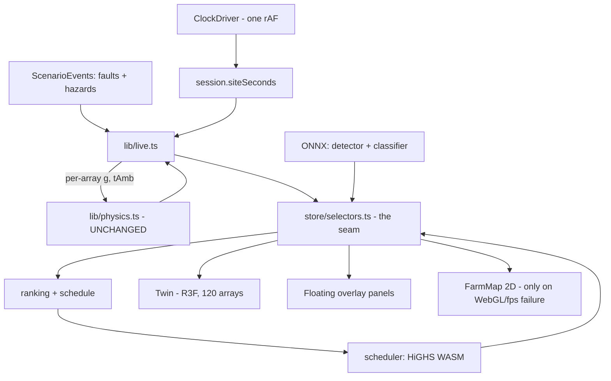
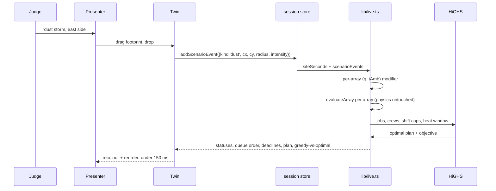

# 04 — Architecture

---

## 1. The finding this whole rework rests on

`src/store/selectors.ts` is a **universal seam**. 35 of ~80 source files import it,
and **no component reads physics, data or the session store directly for display
values**.

So the UI rework is a presentation-layer swap. Every component in
`components/console/` can be deleted and rebuilt against the same selector surface
without touching the data layer, and the 512 tests covering that layer stay green.

Second finding, equally load-bearing: `evaluateArray(g, tAmb, {...})` **already takes
irradiance and ambient as per-array arguments**. `live.ts:163` simply passes the same
site-wide values to all 120. Spatial hazards are therefore a call-site change.
**`physics.ts` never moves.**

## 2. Keep / change / do not touch

| | Module | Reason |
|---|---|---|
| **DO NOT TOUCH** | `src/lib/physics.ts` | Golden-tested against `scripts/physics.py` line for line. Touching it breaks the one thing that makes every number defensible. |
| **DO NOT TOUCH** | `src/lib/types.ts` | Sole schema owner. Extend via new types; never edit existing invariants. |
| **DO NOT TOUCH** | `scripts/physics.py`, `data/*.json` generators | Same reason. If a number is needed, add it to the generator. |
| **DO NOT TOUCH** | `src/store/detector.ts` detector path | 0.995 AP@50 depends on it. The classifier is additive. |
| **CHANGE** | `src/store/selectors.ts` | Add selectors for hazards, schedule, classification. Do not change existing signatures — components depend on them. |
| **CHANGE** | `src/lib/live.ts` | Per-array `(g, tAmb)` from hazards, before `evaluateArray`. |
| **CHANGE** | `src/store/session.ts` | `ScenarioEvent` union gains hazard variants. |
| **CHANGE** | `src/app/globals.css` | Token and type-scale rewrite. The mechanism stays; the scale is replaced. |
| **REBUILD** | `components/console/**` (6,965 LOC) | The rework. |
| **ABSORB** | `components/cinematic/**` | Overlays move onto the twin; the separate mode goes. |
| **EXTEND** | `components/scene/**` | Becomes the main view: 120 arrays, thermal sweep, hazard footprints. |
| **DEMOTE** | `components/console/FarmMap.tsx` | Survives as the F1a fallback only. Keep it fed by selectors. |
| **DELETE** | `src/hooks/useFitToWindow.ts` | The fixed-shell scale is the thing being removed. |
| **DELETE** | `components/console/beats.test.tsx` | Demo mode retired (owner ruling A). |

## 3. Diagram



## 4. Hero data flow



## 5. Interface contracts

```ts
// session.ts — hazards join the existing ScenarioEvent union
type Hazard =
  | { kind: 'dust';  cx: number; cy: number; radius: number; intensity: number }
  | { kind: 'cloud'; cx: number; cy: number; radius: number; intensity: number }
  | { kind: 'heatwave'; intensity: number };   // site-wide: no footprint

// lib/hazard.ts — PURE. The whole sandbox lives here.
function weatherFor(
  panel: PanelArray, baseG: number, baseTAmb: number, hazards: Hazard[]
): { g: number; tAmb: number };

// lib/scheduler.ts
interface Job { id: string; panelId: string; pri: number; dur: number; deadline: number }
interface Plan {
  assignments: Array<{ jobId: string; crew: number; startSlot: number }>;
  objective: number;
  baseline: number;        // greedy — shown beside the optimum
  solveMs: number;
  optimal: boolean;        // false if the WASM fallback ran
}
function solve(jobs: Job[], crews: number, shiftCap: number, heatBan: Set<number>): Plan;

// store/classifier.ts — mirrors store/detector.ts
interface ArrayClassification {
  panelId: string;
  label: string;
  confidence: number;
  basis: 'captured' | 'modelled';   // drives the diagnosed/flagged vocabulary
}
```

## 6. File layout and seams

```
src/
  lib/
    physics.ts        FROZEN - the model
    live.ts           CHANGE - applies hazards, calls physics
    hazard.ts         NEW    - pure: Hazard[] -> per-array (g, tAmb)
    scheduler.ts      NEW    - pure: jobs -> Plan. Wraps HiGHS + greedy.
    lpModel.ts        NEW    - pure: jobs -> LP string. Unit-tested alone.
  store/
    selectors.ts      THE SEAM - additive only
    classifier.ts     NEW    - mirrors detector.ts
  components/
    twin/             NEW    - the main view
    overlay/          NEW    - floating panels
    fallback/         FarmMap.tsx, demoted
```

**Rules between layers**

- `lib/` is pure. No React, no three, no store imports. Testable headless.
- Components **never** import `lib/physics` or `lib/live` directly. Always via
  `selectors`. This is what kept the last rework cheap; it is why this one is cheap.
- `lpModel.ts` is split from `scheduler.ts` deliberately: LP-format string building
  is fiddly and deserves its own unit tests without a WASM dependency.
- `hazard.ts` is pure so the sandbox is testable without a browser and seekable by
  construction.

## 7. What breaks if the rules are broken

| Break | Consequence |
|---|---|
| Hazards applied inside `physics.ts` | Golden test vs Python fails; every number loses its provenance |
| Component imports `live.ts` directly | Rework stops being a presentation swap; the seam rots |
| Scheduler called in a `useFrame` | Second clock; seeking breaks; CLAUDE.md §0.3 violated |
| "Diagnosed" used for a modelled array | Rule §0.5 violated — the project's most repeated bug, now lint-enforced |
| `useFitToWindow` left in | R3F sizes to post-transform pixels again — the phase-24 bug returns |
