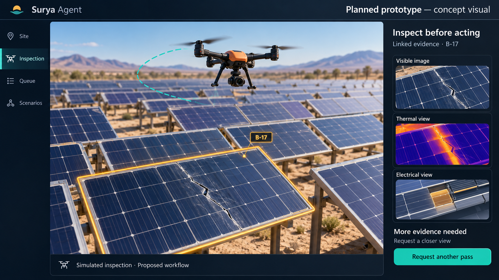
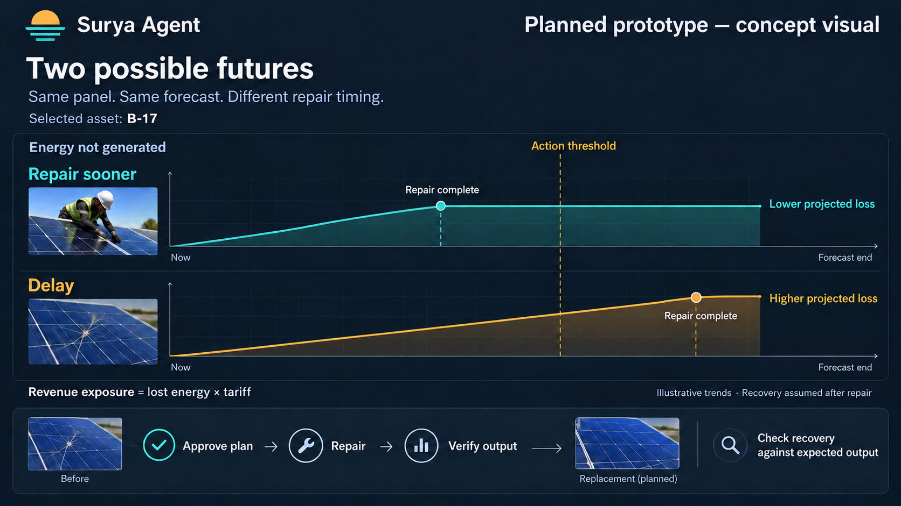

# Surya Agent — Round 1 proposal content

**Event:** JSS Noida – AI FORGE 2026  
**Team:** Sigmoid · JSS University, Noida  
**Theme:** AI for Industry 4.0 — Manufacturing, predictive maintenance, quality control, automation, and digital twins  
**Format:** Eight slides, in the requested order. This file contains slide copy, speaker notes, image placement and sources; it is not a finished PPTX.

## Presentation direction

Explain the idea to a reader who has never operated a solar plant: **we propose a system that helps operators find the right panel, choose the right action, understand the cost of waiting, and check the repair afterwards.**

Use the short **On-slide copy** blocks as the actual slides. Speaker notes provide explanation, not additional text to squeeze onto the slide. Use positive proposal language throughout: “we propose”, “will help”, “planned prototype”, “we will evaluate”. Benefits are intended outcomes to test, not results already achieved.

Use the supplied title reference for its information hierarchy: hackathon name, project name, clear description, team and theme. Use solar and industrial imagery with a navy, teal and warm amber palette. Keep the title readable and the team information organised; the Halloween artwork and the reference project's claims do not belong to this proposal.

The two images in `images/` are generated concept visuals. Both must retain **“Planned prototype — concept visual”** and their captions. They depict proposed interface behaviour, not completed features, real inspections or measured performance. Any curves are illustrative trends rather than calculated results.

---

## Slide 1 — Title

### On-slide copy

**JSS Noida – AI FORGE 2026**

# Surya Agent

**AI-assisted inspection and maintenance planning for solar plants**

We propose to connect a power shortfall to inspection evidence, an approved repair plan and a check of the outcome.

**Team Sigmoid**

- **Team leader:** Rehaan Ahmad Khan
- **Members:** Shantanu Singh · Lakshita Rawat · Krishna Agarwal
- **College:** JSS University, Noida
- **Theme:** AI for Industry 4.0

**Round 1 · Idea proposal**

### Speaker notes

“Solar panels can lose output for different reasons. Our proposal will help an operator understand which panel needs attention, what evidence supports the recommendation, and what should happen next. The operator will approve the action, and the system will help check whether that action restored performance.”

The project will apply digital twins and AI-assisted inspection to solar operations. Predictive maintenance here means using conditions and forecasts to inform maintenance timing; do not describe it as proven prediction of failures before they happen.

### Visual placement

Match the reference's hierarchy, with Surya Agent as the central title and team details beneath it. Keep the full track description in the notes or as a short footer if space permits. No sponsor logo or institutional endorsement is implied. No “live prototype” badge.

---

## Slide 2 — Problem statement

### On-slide copy

**A power drop is a signal. Operators still need an action plan.**

- **Locate:** Which panel or section needs attention?
- **Understand:** Is the cause dirt, shade, damage or changing weather?
- **Prioritise:** Which inspection or repair should happen first?
- **Confirm:** Did the repair bring output back toward its expected level?

**Who will benefit:** solar plant operators, maintenance teams and asset owners.

**Opportunity:** supplement periodic inspection with ongoing monitoring and targeted follow-up.

*Research basis: Turbine Logic / EPRI, hosted on OSTI [R1].*

### Speaker notes

“A solar plant's output changes with sunlight and temperature. A lower reading does not automatically mean a damaged panel. Even when a genuine shortfall is identified, the operator still needs to decide where to inspect and which job matters most. We want to make that decision easier.”

The Turbine Logic / EPRI paper describes periodic aerial infrared inspection as usually annual and reports that subtle faults can remain undetected between surveys. This supports the opportunity to combine continuous monitoring with targeted inspection; it is not a universal survey schedule for every plant. Attribute the cadence claim to Turbine Logic / EPRI on OSTI, not NREL. Do not quote a detection-delay statistic or a market-wide loss percentage.

### Visual placement

Use four concise questions around a simple solar-panel photograph or a native, editable sequence of labels. Avoid a paragraph wall. Keep the beneficiary line visible.

### Sources

[R1 — Field Experience Detecting PV Underperformance in Real Time Using Existing Instrumentation](https://www.osti.gov/servlets/purl/1960134), Scott Sheppard, Tim Cook, Daniel Fregosi, Christopher Perullo and Michael Bolen; Turbine Logic and EPRI. Author-hosted [copy](https://turbinelogic.com/wp-content/uploads/Field_Experience_Detecting_PV_Underperformance_in_Real_Time_Using_Existing_Instrumentation.pdf).

---

## Slide 3 — Our solution

### On-slide copy

**One operating workflow, centred on the repair decision**

**Monitor → Inspect → Explain → Plan → Approve → Repair → Verify**

- Compare output with what the sunlight and temperature suggest it should be.
- Guide a simulated drone to collect useful inspection evidence.
- Link the evidence to a proposed action, urgency and projected cost of waiting.
- Let the operator approve work and review performance afterwards.

**Planned prototype:** an interactive solar-field console with simulated telemetry and drone flights.

### Image

**Caption:** Planned prototype — linked inspection evidence and a request for a closer view.

### Speaker notes

“The operator will see the field, select an incident and follow the evidence. If a photograph is unclear, the system will ask for a closer view rather than jump to a repair recommendation. Once the evidence is sufficient, it will propose an action for the operator to review.”

A digital twin is an interactive representation of the solar field. The first prototype will use simulated plant readings and flights, alongside public visible and infrared imagery for model development and evaluation. Physical drones and live plant feeds will be later integration stages.

Not every case needs a drone. A well-supported cleaning recommendation should preserve inspection capacity for cases where another image could change the decision. Thermal imagery will help examine heat patterns; a dedicated thermal classifier will be a later research stage, not an assumed capability of the first prototype.

### Visual placement

Give the concept image most of the slide width. Keep the workflow as one editable line and the explanatory copy to the side. Retain the image's planned-prototype label.

---

## Slide 4 — Tech stack and flow

### On-slide copy

**The proposed architecture connects evidence to a decision**

**Readings + weather** → **Expected output** → **Inspection** → **Evidence** → **Repair priority** → **Approval** → **Repair** → **Verification**

| Proposed technology | What it will do |
|---|---|
| Next.js · React · TypeScript | Operator web console |
| Three.js · React Three Fiber | 3D field and drone |
| YOLOv8n · ONNX Runtime Web | Panel image analysis |
| PV equations · HiGHS | Output calculations and crew planning |
| Groq-hosted language model | Plain-language evidence explanations |

**AI will interpret evidence. Calculations will determine the numbers. Operators will approve work.**

### Speaker notes

“The 3D view will make the field easy to explore. The image model will identify potential panel defects. A separate calculation layer will estimate lost generation and help order the repair queue. The language model will explain those findings; it will not invent financial values or decide which work order is approved.”

YOLO is a computer-vision model. ONNX Runtime Web will execute the exported model inside the browser. The proposed visible-image training source is SolarVision's public Solar Panel Fault Detection dataset on Roboflow Universe [R3]. Evaluate on held-out photographs and on varied simulated flight views separately; synthetic-scene performance cannot stand in for field validation.

The planning layer will use a declared ranking formula and HiGHS [R5] to explore a crew schedule. Time limits, travel and repair duration will be explicit inputs. The expected-output layer will draw on published PV modelling [R2], with coefficients and forecast assumptions stated. The repo's current technology choices are design inputs for the proposal, not completion claims in this deck.

Zustand will manage interface state and Zod will validate data. These implementation details can remain in the notes to keep the slide accessible. The language-model choice will use the repo's proposed `openai/gpt-oss-120b` endpoint on Groq; no provider endorsement or guaranteed availability is implied.

### Visual placement

Make the flow the main visual, as editable labels and arrows. Keep the stack table secondary. Expand “PV” verbally as photovoltaic, meaning solar electricity generation. Avoid a wall of technology logos.

### Sources

[R2 — PVWatts Version 1 Technical Reference](https://docs.nlr.gov/docs/fy14osti/60272.pdf), Aron P. Dobos, NREL/TP-6A20-60272.  
[R3 — Solar Panel Fault Detection, version 2](https://universe.roboflow.com/solarvision-gwljt/solar-panel-fault-detection/dataset/2), SolarVision, Roboflow Universe.  
[R5 — HiGHS](https://highs.dev/), official optimisation project.

---

## Slide 5 — Our USP

### On-slide copy

**Inspection that helps choose, explain and verify an action**

- **Linked evidence:** select a panel and examine its output, photograph and heat pattern together.
- **Better evidence on request:** ask for a closer view when the image is unclear.
- **Electrical cutaway:** show how a possible fault could affect the panel's cells and circuits.
- **Two possible futures:** compare “Repair sooner” with “Delay” using projected energy loss, revenue exposure and deadline crossings.
- **Repair and verification:** approve the action, then check whether output recovered toward expectation.

### Image

**Caption:** Planned prototype — compare two repair timings, then verify the outcome. Curves are illustrative.

### Speaker notes

“Our emphasis will be the decision after the alert. The operator will be able to compare what could happen if a repair starts sooner or is delayed. They will also see why the system recommends an action and what evidence would be needed to confirm it.”

The five ideas form one flow: link evidence, request what is missing, explain a possible mechanism, compare decisions, and check the result. Present them as connected steps rather than unrelated attractions.

A planned scenario sandbox will let the operator change conditions, such as cloud cover or dust, and see how the projected output and work priorities respond. Explain clouds as changing sunlight and dust as a possible cleaning need; different causes should lead to different next steps.

For **Two possible futures**, hold the starting state and weather forecast constant, change the proposed repair start time, and calculate both timelines with the same assumptions. Show accumulated energy not generated, its tariff-based revenue exposure and crossings of a declared action threshold. This is a projection for comparing decisions, not promised savings, net profit or an independently certified safety deadline. Repair duration and the assumed recovery after completion will be visible inputs.

For the **electrical cutaway**, reveal cells, connected cell groups and bypass diodes, which provide an alternative current path around an affected group. Show a possible mechanism consistent with the evidence. Do not imply that every visible glass crack proves electrical damage or fixes the location of a thermal hotspot. Heat evidence and electrical assumptions will be distinguishable.

For **better evidence**, planned triggers will include blur, poor view angle or an uncertain model result. The prototype will first simulate another capture. A low-quality image will not be treated as proof that a panel is healthy.

For **repair verification**, compare before and after output against a weather-adjusted expectation. If a shortfall remains, reopen the incident for review instead of simply marking it resolved. Closure will remain an operator decision.

These are proposed product differentiators, not claims that no existing company has similar capabilities.

### Visual placement

Use the comparison image on one half of the slide and five short feature descriptions on the other. Keep the detailed explanations in the notes. The diagram should make the repair timing comparison understandable without numerical claims.

---

## Slide 6 — Feasibility and viability

### On-slide copy

**A focused prototype with a practical route to deployment**

**Build:** a browser-based field simulation, image inspection, linked evidence and a repair queue.

**Extend:** decision timelines, electrical explanation, requests for another view and repair verification.

**Validate:** test image detection across viewpoints, check calculations and ask operators to review the recommendations.

**Deploy progressively:** public datasets → operator pilot → live plant and drone integrations.

**Potential customers:** solar asset owners and maintenance providers. We will test a subscription model through pilot feedback.

### Speaker notes

“We will start with a software prototype that can demonstrate the full decision flow without waiting for field hardware. Public image datasets and a simulated field will support repeatable testing. The next step will be a pilot with operators to establish whether the recommendations are useful in actual maintenance work.”

Treat the extended visuals as staged implementation goals, rather than assuming all are equally necessary for the first demonstration. Core success will be a traceable incident that leads to a proposed, operator-approved action. No guaranteed build-completion time, latency, accuracy or customer commitment is claimed.

Validation will include held-out image evaluation, healthy-panel controls, varied camera angles, checks of energy and money calculations, and a user review of whether the recommended action is understandable. A classifier for thermal fault categories will need its own training and held-out evaluation before integration. Until then, infrared evidence will be inspected and compared without claiming an automated thermal classification result.

Startup viability is a hypothesis to test: a subscription for plant owners or maintenance providers could be justified if pilots show useful decision support and reduced avoidable loss. Pilot design will consider onboarding, integration effort and willingness to pay. A larger-site or multiple-site rollout will follow performance testing, not assumed unlimited scale.

The research direction will be evidence quality and maintenance decision evaluation. We will document results for potential publication and explore incubation with the university. Patent potential will require prior-art review; no patent, publication or partnership is claimed. Any deployment will account for third-party model and software licences, including the repository's AGPL-3.0 licence.

### Visual placement

Use two clear columns, “Build and validate” and “Pilot and grow”, with a simple progression between them. Avoid a dense timeline or a speculative revenue chart.

---

## Slide 7 — Impact and benefits

### On-slide copy

**Better maintenance decisions could preserve more solar generation**

- **Operators:** clearer evidence and a practical next action.
- **Maintenance teams:** inspections and repairs prioritised around urgency and crew capacity.
- **Asset owners:** visibility into projected energy loss and revenue exposure.
- **Energy users:** potential for more dependable output from existing solar assets.

**How we will measure value:** decision time, detection quality, projected avoidable loss, and recovery against expected output after a repair.

**The goal:** help the same solar assets deliver more useful energy through better maintenance.

### Speaker notes

“The value will come from making the right intervention at the right time, then checking the outcome. We will measure whether the operator can understand the issue more quickly and whether the proposed action is supported by the evidence.”

Separate evaluation types. Scenario studies will compare projected loss under different repair timings. Operator studies will measure task completion time and recommendation clarity. Field pilots, when available, will compare measured recovery with weather-adjusted expected output. Simulated recovery will not be reported as an observed plant improvement.

Revenue exposure will mean projected lost generation multiplied by a sourced tariff, not a guaranteed increase in profit. Future comparisons should include repair costs when reliable inputs exist. No percentage savings, carbon reduction, market size or investment return is asserted here. The benefits are positive intended outcomes whose size will be established through validation.

### Visual placement

Give each beneficiary one short statement. Finish with the measurement line. Do not use large fabricated savings counters.

---

## Slide 8 — Research and references

### On-slide copy

**Published research and open datasets will support the prototype**

- **Turbine Logic / EPRI · OSTI:** PV underperformance detection using existing plant instrumentation [R1].
- **NREL PVWatts:** a published basis for estimating expected solar output [R2].
- **SolarVision · Roboflow Universe:** labelled visible-image panel-defect data [R3].
- **Raptor Maps:** InfraredSolarModules, a public infrared imagery dataset [R4].
- **HiGHS:** optimisation software for the proposed crew-planning layer [R5].

**Planned research:** evaluate evidence quality, decision usefulness and repair verification.

**Open-source models, libraries and external APIs will be acknowledged.**

### Speaker notes and full references

**R1.** Scott Sheppard, Tim Cook, Daniel Fregosi, Christopher Perullo and Michael Bolen, *Field Experience Detecting PV Underperformance in Real Time Using Existing Instrumentation*. Turbine Logic and EPRI; hosted on [OSTI](https://www.osti.gov/servlets/purl/1960134). [Author-hosted paper](https://turbinelogic.com/wp-content/uploads/Field_Experience_Detecting_PV_Underperformance_in_Real_Time_Using_Existing_Instrumentation.pdf). Supports the monitoring and periodic-inspection problem. Its reported detection metrics belong to that research, not Surya Agent.

**R2.** Aron P. Dobos, *PVWatts Version 1 Technical Reference*, NREL/TP-6A20-60272. [Official PDF](https://docs.nlr.gov/docs/fy14osti/60272.pdf). Supports the physical modelling foundation. The first prototype will use a simplified implementation with its own stated coefficients; it will not be presented as the complete current PVWatts service. Report 60272 is the Version 1 reference, not the Version 5 manual.

**R3.** SolarVision, *Solar Panel Fault Detection*, dataset version 2, [Roboflow Universe](https://universe.roboflow.com/solarvision-gwljt/solar-panel-fault-detection/dataset/2). Published as CC BY 4.0 on the dataset page. Proposed visible-image training/evaluation source. Dataset class labels and panel-level boxes will determine what the model can report; crack-path segmentation is not assumed.

**R4.** Raptor Maps, *InfraredSolarModules*. [Official repository](https://github.com/RaptorMaps/InfraredSolarModules). The repository identifies an MIT licence and links its original ICLR workshop paper. Supports thermal-image research and visual evidence development. It does not establish a trained thermal classifier for this proposal.

**R5.** [HiGHS](https://highs.dev/), official optimisation software project. Proposed scheduling technology, not independent validation of the business benefit.

**Tariff context, if asked:** [IEA — Auction of Solar Corporation of India (SECI)](https://www.iea.org/policies/6373-auction-of-solar-corporation-of-india-seci). The repository contains a capacity-weighted Bhadla Phase-III tariff calculation in `src/lib/money.ts`. No numerical tariff or financial result is needed for this short proposal. A pilot will use the relevant plant's verified tariff.

**Architecture inspiration:** the existing repository credits a Robinsun solar-agent workflow. Acknowledge this inspiration if discussing provenance; do not claim its awards, hardware or performance as our team's work. The public link and award attribution were not independently established for this content, so no such claims appear on the slides.

**Technology acknowledgement:** proposed use of Next.js, React, TypeScript, Three.js, React Three Fiber, Zustand, Zod, Ultralytics YOLOv8n, ONNX Runtime Web, HiGHS and a Groq-hosted language model. The team will preserve required notices and review applicable terms before deployment. Names identify technology choices, not sponsors.

**Event alignment:** the organiser text supplied by the team asks for the problem and beneficiaries, the proposed AI solution, uniqueness and expected impact, prototype architecture and future scope. Slides 2–3 cover the problem and solution, slides 4–5 explain the architecture and distinctive flow, and slides 6–7 explain validation, deployment and intended value. The cover uses the user-confirmed Industry 4.0 track and team details.

### Visual placement

Use compact source names on the slide with clickable hyperlinks. Keep full titles and provenance in the notes. This remains slide eight, not an extra appendix slide.

---

## Image placement manifest — production notes, not an extra slide

| File | Place on | Purpose | Required caption |
|---|---|---|---|
| `images/01-planned-inspection-workspace.png` | Slide 3 | Show the proposed 3D inspection workspace, linked evidence and a request for another capture | Planned prototype — linked inspection evidence and a request for a closer view |
| `images/02-planned-two-futures.png` | Slide 5 | Show proposed repair-timing comparison and the path to verification | Planned prototype — compare two repair timings, then verify the outcome. Curves are illustrative |

The files are concept art, not product screenshots or evidence of a successful CV run. All final slide titles, explanatory text and captions should be editable PowerPoint text. Images illustrate the intended interaction; their curves and colours are not performance data.
