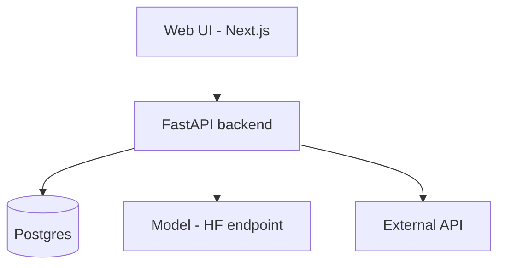
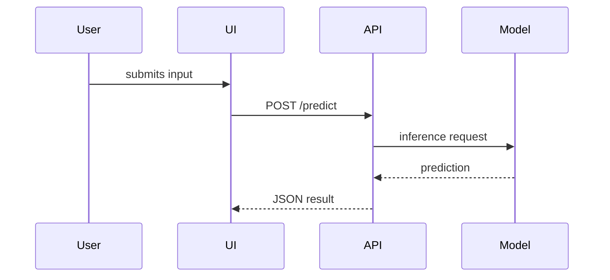

# Plan Pack Template - section-by-section spec

The plan lives in a `plan/` directory of Markdown files. The bar is: **a capable coding agent (or a junior teammate) can open `plan/` and build the whole thing without coming back to ask questions.** That means concrete names, real types, real payloads, and the *why* behind every non-obvious choice. See `buildable-detail-standards.md` for what "concrete enough" means, with examples - read it before writing.

Some files are **conditional**: only write the data-model file if the project persists data, and the design-system file only if it has a UI. Don't pad a project with files it doesn't need.

---

## `plan/00-overview.md`

- **Problem** - the specific thing being built, in 1-2 sentences.
- **The one principle** - a single sentence that judges every feature, so scope stays honest. (Vayugati's was "every feature makes the response earlier in time or finer in space; if it does neither, cut it.") Derive one that fits this project.
- **North-star metric** - the single number that defines success, if one exists.
- **Target users & usage** - who uses it, on what surface (web/mobile/API/CLI/device). If multi-role, name each role.
- **The angle** - what makes this distinct from prior art (from your web research). One sharp sentence.
- **Scope** - two lists: *In scope* and *Explicitly out of scope*. The out-of-scope list protects the timeline.
- **Hard constraints** - required tech, sponsor APIs, track rules, offline/latency needs.
- **Success = one complete journey** - describe the single end-to-end path the finished demo must show working, as one sentence with arrows (e.g. "input → processed → stored → shown → acted on"). Everything in the MVP exists to make this journey real.

## `plan/01-features.md`

The maximalist, ambitious feature list - then disciplined tagging. If the product is multi-role, group features by role. For each feature:

```
### <Feature name>  [MVP | V2 | STRETCH]
- **Story:** As a <user/role>, I can <do X> so that <benefit>.
- **Acceptance:** <a concrete, checkable condition that proves it works>
- **Depends on:** <feature/component it needs first, if any>
- **Notes:** <key technical dependency, API, or gotcha>
```

- **[MVP]** = the demo fails without it. Keep this set small and ruthless; it must sum to the "one complete journey" above.
- **[V2]** = builds if MVP finishes early.
- **[STRETCH]** = the "wow" extras; never blocking.
Order features within each tag by build dependency.

## `plan/02-architecture.md` (the technical heart)

1. **Component overview** - the major building blocks (frontend, services, model, DB, external APIs) and each one's single responsibility.
2. **Architecture diagram** - both an **ASCII** sketch (fast to read in a terminal) and a **Mermaid** `flowchart`/`graph` (see formats below). Show what talks to what and with which key.
3. **Data-flow diagram** - a Mermaid `sequenceDiagram` tracing one request from entry to output.
4. **API / interface contracts** - real endpoints: method, path, request payload, response shape (JSON). For ML: the model's input/output contract. Concrete enough to code against.
5. **Tech-stack decisions (ADR-style)** - one block per significant choice (format below). "Locked" stack list at the end for quick reference.
6. **File / module layout & conventions** - the directory tree you intend, plus the *rules* that keep it navigable. Steal Vayugati's best move: name the seams ("all DB access lives in `lib/data.ts`; components never query the DB directly, so table names live in one file"). These conventions are what let an agent extend the code without breaking it.
7. **External dependencies & data sources** - each API/model/dataset with: link, auth needs, rate limits, licensing, and a **fallback**. Apply the **demo-safe rule**: cache a static snapshot so a rate limit or outage on demo day can't kill the live pull.
8. **Environment variables** - the exact env var names the build will need, grouped by service, each with a one-line purpose. Saves the agent from inventing them.

### Mermaid formats

Architecture:

Data flow:


### ADR block format (for each stack decision)
```
#### Decision: <e.g. Postgres for storage>
- **Context:** <why a choice is needed here>
- **Options considered:** <A vs B vs C, one line each>
- **Chosen:** <the pick> because <reason - speed to build, team familiarity, reliability, fit>
- **Consequences:** <what this makes easy / hard later>
```

## `plan/03-data-model.md` (conditional - only if the project persists data)

This is one of the biggest buildability levers. Include:

1. **ER diagram** - Mermaid `erDiagram` of entities and relationships.
2. **Table-by-table spec** - a table listing every table: name, purpose, and key columns *with types*. Real schema, not prose.
   ```
   | Table | Purpose | Key columns |
   |---|---|---|
   | reports | citizen submission | id uuid pk, ward_id fk, status report_status, photo_url text, created_at timestamptz |
   ```
3. **Enums enumerated** - every enum with its full list of values (e.g. `report_status: submitted | verified | acted | resolved | rejected`). Agents get these wrong when they're implied; spell them out.
4. **Relationships & keys** - foreign keys and cardinality called out.
5. **Permissions matrix** (if there's auth/multi-role) - a table of who can read/write each table. Vayugati's RLS matrix is the model.
6. **Seed data** - what must be pre-loaded for the demo to work (e.g. "the 13 wards", a demo user per role).
7. **Runnable `schema.sql` companion** - alongside this doc, emit an actual runnable schema file (`plan/schema.sql` for SQL projects, or the equivalent - a Prisma/Drizzle schema, a Mongoose model file, a `CREATE TABLE` script). This is the single biggest head-start for the build: the coding agent runs one file instead of re-deriving the schema from prose. Keep it in exact sync with the table-by-table spec above, and note at the top of the doc that the two must stay aligned.

## `plan/04-design-system.md` (conditional - only if the project has a UI)

Makes the UI buildable and consistent instead of improvised per-screen.

- **Design tokens** - exact color hex values (with roles: primary, background, surfaces, and semantic status colors reserved for state only), typography stack, spacing/radii/shadow scale. One source of truth.
- **Layout / shell** - the app frame (nav, top bar, main area) and how screens sit inside it.
- **Component states** - the full set every data view must handle: loading, empty, error, **stale**, **partial**, **offline**. Naming these upfront is what stops "it only works on the happy path."
- **Accessibility** - contrast target, color-is-never-the-only-signal, keyboard nav, any i18n/script needs.
- **Screen inventory** - one line per screen the MVP needs, mapped to the features in `01`.

## `plan/05-build-plan.md`

- **Build order** - MVP-first, phased. **Each phase ends at a working vertical slice with an explicit "Definition of done"** - something you could demo if the clock stopped there. State the DoD as a checkable sentence ("a report goes citizen → field → resolved and the timestamps are in the DB").
- **Timeline (optional)** - map phases to the hackathon window ("Hour 0-6: ...").
- **Task breakdown** - concrete tasks; if it's a team, assign by the strengths captured in grilling. Mark which tasks run in parallel vs. must be sequential, and call out **integration points** (where separate people's work must meet - where hackathons stall).
- **Decisions made (override if you disagree)** - the judgment calls you made for them, stated so they can veto. Reduces churn.
- **What NOT to build (yet)** - an explicit list. The single most effective scope-protector in the Vayugati docs.

## `plan/06-risks.md`

For each significant risk:
```
### <Risk>
- **Likelihood / impact:** <low/med/high each>
- **Signal:** <how you'll know it's happening>
- **Fallback:** <the concrete plan B - a simpler approach, a cached/faked input, a cut feature>
```
Prioritize risks that threaten the MVP demo. **Every high-risk technical bet must have a fallback that still yields a demo** (this is the demo-safe rule applied to risk).
